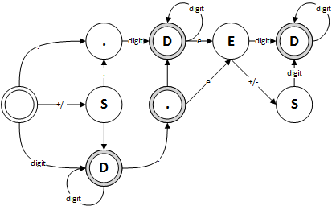

Valid Number
==========

## C++


```cpp
class Solution {
public:
    bool isNumber(string s) {
        // STATE TABLE
        // 0 - start
        // 1 - ._1
        // 2 - digit_1
        // 3 - sign_1
        // 4 - digit_2
        // 5 - e
        // 6 - digit_3
        // 7 - sign_2
        // 8 - end
        // 10 - ._2
        int state = 0;
        for(auto ch : s)
        {
            if(state == 0)
            {
                if(ch == ' ')
                    continue;
                else if(ch == '.')
                    state = 1;
                else if(ch == '-' || ch == '+')
                    state = 3;
                else if(isdigit(ch))
                    state = 2;
                else
                    return false;
            }
            else if(state == 1)
            {
                if(isdigit(ch))
                    state = 4;
                else
                    return false;
            }
            else if(state == 2)
            {
                if(isdigit(ch))
                    continue;
                else if(ch == '.')
                    state = 10;
                else if(ch == 'e')
                    state = 5;
                else if(ch == ' ')
                    state = 8;
                else
                    return false;
            }
            else if(state == 3)
            {
                if(isdigit(ch))
                    state = 2;
                else if(ch == '.')
                    state = 1;
                else
                    return false;
            }
            else if(state == 4)
            {
                if(isdigit(ch))
                    continue;
                else if(ch == 'e')
                    state = 5;
                else if(ch == ' ')
                    state = 8;
                else
                    return false;
            }
            else if(state == 5)
            {
                if(isdigit(ch))
                    state = 6;
                else if(ch == '-' || ch == '+')
                    state = 7;
                else
                    return false;
            }
            else if(state == 6)
            {
                if(isdigit(ch))
                    continue;
                else if(ch == ' ')
                    state = 8;
                else
                    return false;
            }
            else if(state == 7)
            {
                if(isdigit(ch))
                    state = 6;
                else
                    return false;
            }
            else if(state == 8)
            {
                if(ch != ' ')
                    return false;
            }
            else if(state == 10)
            {
                if(isdigit(ch))
                    state = 4;
                else if(ch == 'e')
                    state = 5;
                else if(ch == ' ')
                    state = 8;
                else
                 return false;
            }
        }
        return state == 6 ||
               state == 10||
               state == 2 ||
               state == 4 ||
               state == 8;
    }
};
```
